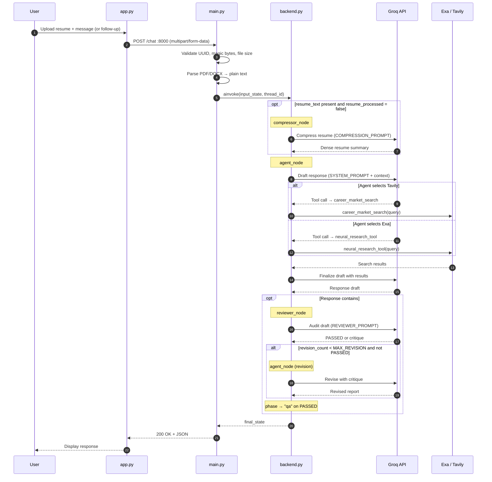

# Groovia: Immigroov's Virtual AI Assistant

Groovia is an agentic AI backend that maps a user's resume to optimal global career or study destinations using real-time search data. It is built with LangGraph (reflection pattern), served via FastAPI, and containerised with Docker.

The frontend (Streamlit) communicates with the backend exclusively through the REST API.

---

## System Architecture (Sequence Diagram)



---

## Project Structure

```
├── main.py          # FastAPI app — request handling, file parsing, session routing
├── backend.py       # LangGraph graph — nodes, edges, reflection loop
├── utils.py         # Tool definitions (Tavily, Exa) and file parsers
├── prompts.py       # All LLM prompt templates
├── config.py        # Environment variables and model settings
├── schema.py        # Pydantic request/response models
├── Dockerfile
├── docker-compose.yaml
└── .env             # Not committed — see Environment Variables below
```

---

## API

### `POST /chat`

Accepts a user message and optional resume file. Maintains conversation state across turns using `thread_id`.

**Form fields**

| Field | Type | Required | Description |
|---|---|---|---|
| `message` | `string` | Yes | User's message |
| `thread_id` | `string (UUID)` | Yes | Persistent session identifier |
| `file` | `file` | No | PDF or DOCX resume (max 5MB) |

**Response**

```json
{
  "status": "success",
  "response": "...",
  "thread_id": "uuid"
}
```

**Error codes**

| Code | Reason |
|---|---|
| 400 | Invalid `thread_id` format |
| 413 | File exceeds 5MB limit |
| 415 | Unsupported or mismatched file type |
| 504 | Agent timed out (> 120s) |
| 500 | Internal agent error |

### `GET /health`

Returns `{"status": "ok"}`. Used by Docker and Render for readiness checks.

---

## Agent Graph

The graph follows a **reflection pattern** with phase-aware routing to minimise LLM calls on follow-up turns.

```
START → (compressor) → agent → tools → agent → (reviewer) → agent (if rejected) → END
```

The compressor and reviewer are conditional — they only run when needed:

| Node | Trigger | Role |
|---|---|---|
| `compressor_node` | New unprocessed resume in state | Compresses raw resume text once per session |
| `agent_node` | Every turn | Drafts the response using tools |
| `reviewer_node` | Response contains `###` country headers | Audits the draft against a quality checklist |

Once the country report passes review, `phase` is set to `"qa"`. All follow-up turns go directly `START → agent → END`, skipping the compressor and reviewer entirely.

The agent self-selects between Tavily and Exa on each tool call based on the tool descriptions — no separate router LLM call is needed.

The reviewer rejects and re-queues the draft up to `MAX_REVISION` times before passing it regardless.

---

## Environment Variables

Create a `.env` file in the project root:

```
GROQ_API_KEY=your_groq_key
TAVILY_API_KEY=your_tavily_key
EXA_API_KEY=your_exa_key
```

---

## Running Locally

```bash
pip install -r requirements.txt
uvicorn main:api --host 0.0.0.0 --port 8000 --reload
```

The API will be available at `http://localhost:8000`.

To run both services together with Docker:

```bash
docker compose up --build
```

API at `http://localhost:8000` · UI at `http://localhost:8501`.

---

## Configuration

All tunable parameters are in `config.py`:

| Parameter | Default | Description |
|---|---|---|
| `NUM_COUNTRIES` | `3` | Number of countries in the report |
| `MAX_REVISION` | `2` | Max reviewer rejection cycles per response |
| `TEMPERATURE` | `0.0` | LLM temperature |
| `PORT` | `8000` | Server port |

---

## Deployment

The backend deploys to Render as a Docker Web Service.

1. Push the repo to GitHub.
2. Create a new **Web Service** on Render, connect the repo.
3. Set the runtime to **Docker** — Render will build from the `Dockerfile` automatically.
4. Set the environment variables in the Render dashboard (do not commit `.env`).
5. The `/health` endpoint is used as the health check URL.

> **Note:** `MemorySaver` stores conversation state in-process. A container restart will clear all session history. A persistent checkpointer (Redis or Postgres) is planned for a future release.

---

## Frontend

The Streamlit frontend (`app.py`) is maintained as a separate service and is not included in this container. It communicates with the backend via the `/chat` endpoint and resolves the API address from the `BACKEND_URL` environment variable.
